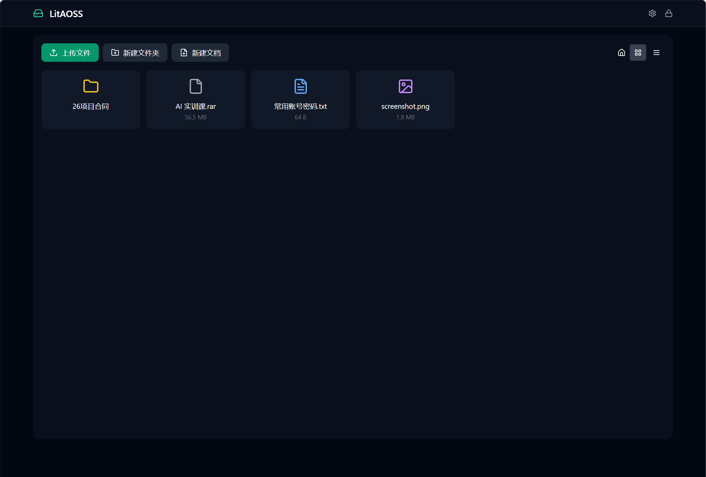
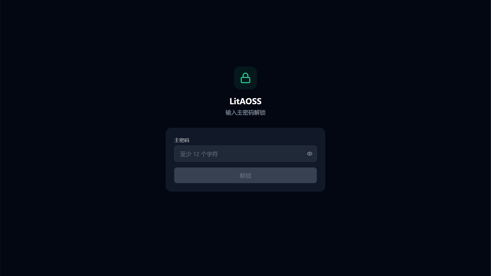
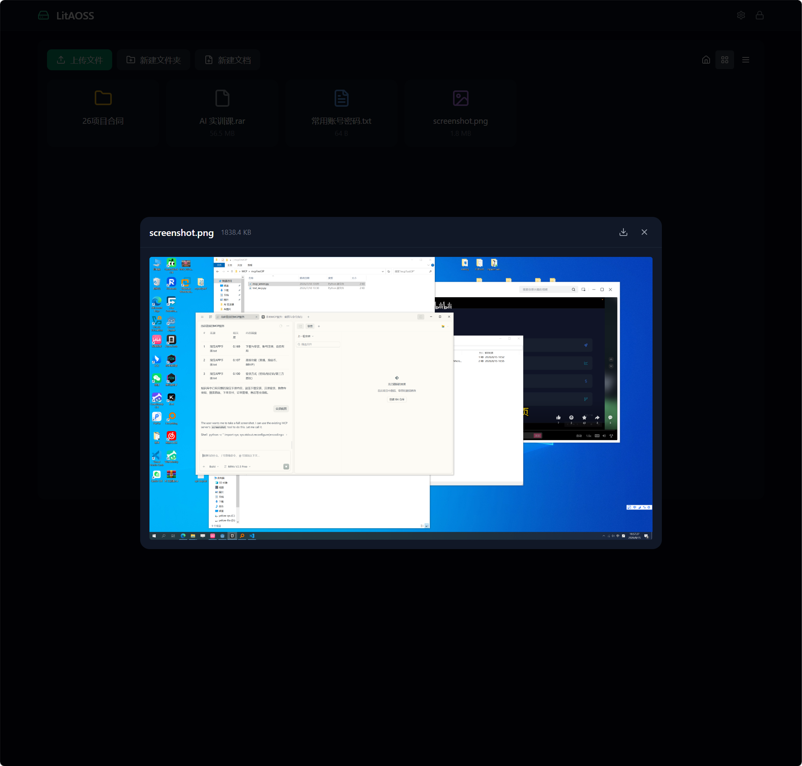
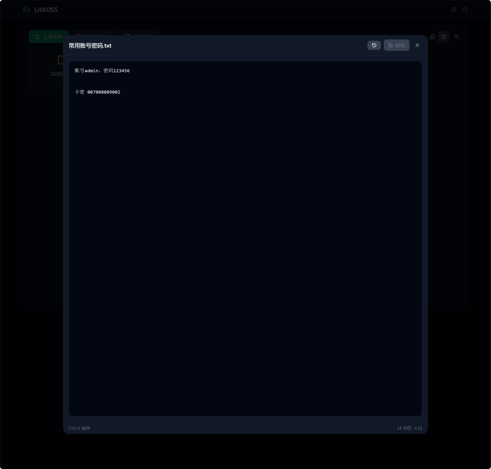
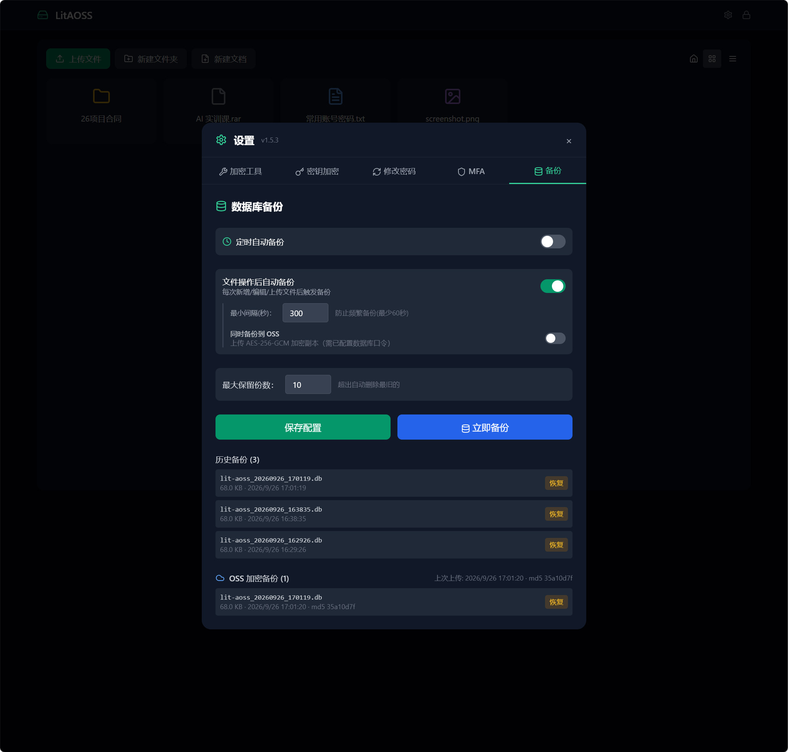
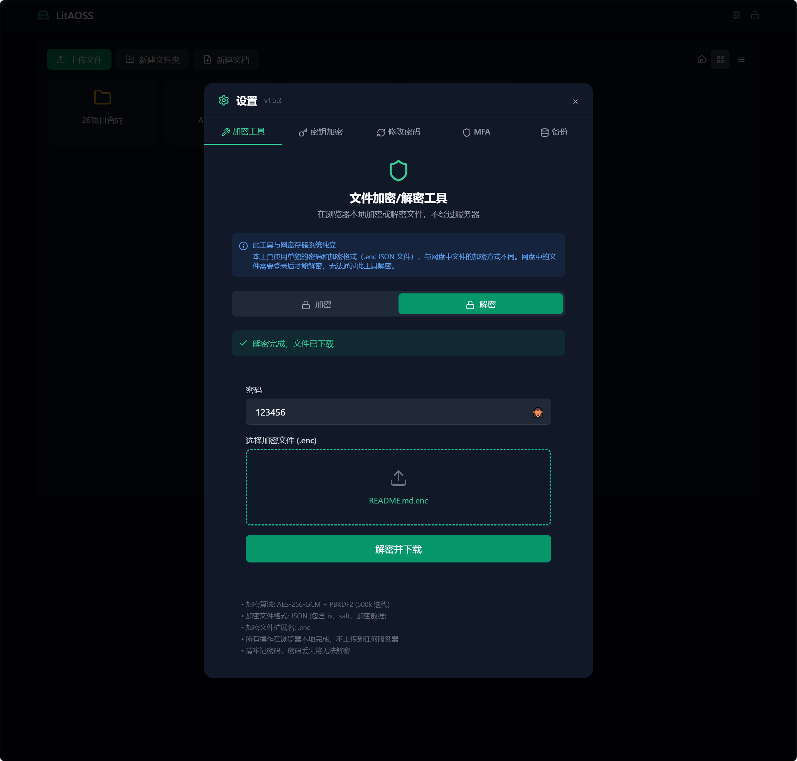
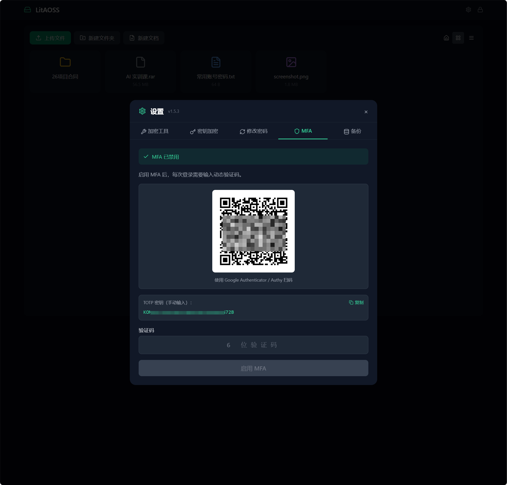

# LitAOSS

**端到端加密的零知识私有网盘** —— 文件在浏览器端加密后再上传阿里云 OSS，服务端全程不接触明文与密钥；没有你的主密码，拿到数据库和 OSS 密文也无法解密。



## 目录

- [功能特性](#功能特性)
- [界面预览](#界面预览)
- [安全架构](#安全架构)
- [数据丢失与恢复（重要）](#数据丢失与恢复重要)
- [快速开始](#快速开始)
- [独立加密工具](#独立加密工具)
- [数据库备份](#数据库备份)
- [支持的预览格式](#支持的预览格式)
- [安全说明](#安全说明)
- [注意事项](#注意事项)
- [文档](#文档)

## 功能特性

### 文件与存储

- 加密后直传 OSS，服务端只见密文；下载后在本地解密
- 文件夹管理、网格/列表视图切换、存储统计
- **拖拽上传**：拖入文件区域显示虚线提示，松手后弹出上传队列，确认后逐个上传；支持文件夹（保持目录层级）、逐项移除/清空/取消/失败重试
- **弹窗交互**：所有弹窗点击外部区域不会关闭，仅可通过关闭/取消按钮退出；编辑器存在未保存修改时关闭需先确认（保存并关闭 / 放弃修改 / 取消）
- 图片、文本、**PDF、Word (.docx)、Excel (.xlsx/.xls/.xlsm)、PPT (.pptx)** 在线预览（类型白名单 + 分级大小限制，本地解密渲染，校验不通过不发请求）
- 文本文件在线编辑保存，自动生成版本历史，可回滚
- 软删除：OSS 对象不物理删除，写入回收站台账，可恢复

### 安全与账号

- 零知识架构：主密码只在浏览器派生 Auth Hash 与 Account Key，服务端只存验证哈希
- 改主密码只重新包装 Account Key，所有文件内容与文件名不受影响
- Session Token 鉴权 + 可选 MFA (TOTP)；登录失败 5 次锁定 15 分钟
- **单会话在线**：新登录自动踢下线其它设备，不允许同时在线
- **30 分钟空闲自动退出**：无输入操作（含浏览器最小化、锁屏的离屏时段）自动退回登录页
- SecretKey 与数据库文件均可加密存储（scrypt / AES-256-GCM）
- 后端版本号仅在登录成功后返回（设置页展示），匿名接口不暴露指纹

### 备份与恢复

- 手动 / 定时 / 文件变更三种触发的数据库快照（`VACUUM INTO` 一致性，含 WAL）
- 可选 AES-256-GCM 加密上传 OSS 异机副本，内容未变化自动按 MD5 跳过
- 一键恢复本地或 OSS 备份（OSS 恢复需 TOTP 验证）；恢复先暂存、重启服务端生效

## 界面预览

|  |  |
|:--:|:--:|
|  |  |
| <sub>登录 / 主密码解锁</sub> | <sub>图片与文本在线预览</sub> |
|  |  |
| <sub>文本编辑保存与版本历史</sub> | <sub>设置 → 备份与恢复</sub> |
|  |  |
| <sub>独立加密/解密工具（纯浏览器端）</sub> | <sub>MFA (TOTP) 绑定与验证</sub> |

## 安全架构

```
主密码 + Salt
  ├─ PBKDF2 (500k, 裸 salt) ─────────────▶ Auth Hash (服务端验证)
  └─ PBKDF2 (500k, salt‖"account-key") ──▶ Master Key (AES-KW)
                                                │
                                          Account Key (包装后存 DB)
                                          也用于加密文件名
                                                │
                                    ┌───────────┴───────────┐
                                    │                       │
                              File Key₁  File Key₂ ... (每文件独立随机，包装后存 DB)
                                    │
                              AES-GCM 加密文件内容 ──▶ OSS
```

- Account Key 是随机生成的账户级密钥，**File Key 与文件名一律由 Account Key 保护**；改主密码只重新包装 Account Key，所有文件（内容 + 名称）不受影响
- Auth Hash 与 Account Key 包装密钥来自**两次独立的 PBKDF2 派生**（裸 salt / `salt‖"account-key"` 域分离），前端两处实现（`crypto.ts` / `fileKey.ts`）必须严格一致
- Master Key 由主密码派生；**解锁材料（主密码/salt/包装密钥/Session Token）只保存在页面内存中**，刷新、新标签页、关闭页面或锁定都需要重新输密码
- 服务端只存储加密后的 Account Key 和包装后的 File Key，无法自行解包
- 每个文件独立密钥，互不影响；文件密钥与 IV 全部存在数据库中
- SecretKey (阿里云) 可配置为加密存储，启动时用口令解密
- 数据库文件支持加密存储，停止服务后自动加密
- API 鉴权: 登录后生成 Session Token，所有文件操作需要验证

## 数据丢失与恢复（重要）

**数据库就是本系统的"密钥库"**。解密 OSS 文件需要两样东西：

1. 主密码（派生 Master Key）
2. 数据库中的密钥材料（被包装的 File Key、IV、OSS 对象键、加密文件名）

| 场景 | 结果 |
|------|------|
| 数据库丢失，且无备份、无已登录会话 | **永久无法解密** — 即使知道主密码也没用，被包装的 File Key 已不存在 |
| 数据库丢失，但有 `data/backups/` 备份 | 恢复备份后即可正常解密 |
| 数据库泄露（被攻击者拿到） | 攻击者仍需主密码才能解包；强密码安全，弱密码可能被离线爆破 (PBKDF2 500k) |
| 主密码遗忘 | **永久无法解密**（服务端只有 Auth Hash，无法找回） |
| OSS 对象泄露（含 OSS 凭证被盗） | 仅得到密文，没有主密码 + 数据库密钥材料无法解密 |

因此：

- `data/` 目录与 `data/backups/` 等同于密钥库，**必须和 OSS 一样妥善备份**
- 定期使用 设置 → 备份 创建快照，并把备份存到安全的离线位置
- 页面内存中的解锁材料仅当次会话有效，**不是备份**

更完整的威胁模型与已知风险见 [docs/security.md](docs/security.md)。

## 快速开始

### 1. 配置

复制配置模板并按需修改：

```bash
cp backend/config.example.json backend/config.json   # Windows: copy
```

至少修改这几项：

| 字段 | 说明 |
|------|------|
| `oss.access_key` | 阿里云 AccessKey ID（明文） |
| `oss.bucket` / `oss.endpoint` / `oss.region` | Bucket 名称与地域 |
| `oss.encrypted_sk` | 加密后的 SecretKey（见第 3 步，初始可留空） |
| `server.allowed_origin` | 前端访问域名（本地开发默认 `http://localhost:3000`） |
| `backup.*` | 自动备份与 OSS 上传开关（默认全关） |

### 2. 配置加密口令

SecretKey 加密和数据库加密共用一个口令，通过以下方式配置：

```bash
# 方式1: 环境变量 (推荐)
set LITAOSS_PASSPHRASE=your-passphrase

# 方式2: 文件 (在 backend 目录创建 passphrase.txt)
echo your-passphrase > backend/passphrase.txt
```

### 3. 加密 SecretKey

1. 启动前端 `npm run dev`
2. 登录后点击右上角齿轮图标 → 密钥加密配置
3. 输入 SecretKey 和口令，点击加密
4. 复制生成的 `encrypted_sk` 到 `config.json`
5. 将 `secret_key` 字段设为空字符串
6. 重启后端

### 4. 启动后端

```bash
cd backend
go mod tidy
go run cmd/server/main.go
```

### 5. 启动前端

```bash
cd frontend
npm install
npm run dev
```

访问 http://localhost:3000，首次进入会引导你设置主密码。

## 独立加密工具

设置 → 加密工具入口，提供浏览器端文件加密/解密：

- **加密**: 选择文件 + 输入密码 → 下载 `.enc` JSON 文件
- **解密**: 选择 `.enc` 文件 + 输入密码 → 下载原始文件
- 所有操作在浏览器本地完成，不上传到任何服务器
- 适用于文件分享前加密、接收文件后解密

> **注意**: 此工具与网盘存储系统完全独立。加密格式、密钥派生方式均不同，网盘中管理的文件无法通过此工具解密，反之亦然。

## 数据库备份

设置 → 备份标签页，支持：

- **手动备份**: 立即创建数据库快照，弹窗可选「仅备份数据库」或「备份并上传 OSS」
- **定时备份**: 每天指定时间自动备份（修改开关/时间无需重启）
- **操作触发备份**: 新增/编辑/上传文件后自动备份，带最小间隔防风暴 (默认 5 分钟)
- **OSS 加密备份**: 定时/操作触发各有一个独立的「同时备份到 OSS」开关；上传前用 AES-256-GCM 加密（密钥 = scrypt(数据库口令)），内容无变化时按 MD5 自动跳过
- **备份管理**: 查看本地历史备份与 OSS 加密备份列表，一键恢复（OSS 恢复需 TOTP 验证）；恢复内容**暂存**为 `.restore` 文件，**重启服务端后生效**（暂存期间运行中服务不受影响）
- 本地备份为 `VACUUM INTO` 一致性快照（含 WAL 未 checkpoint 数据），存储在 `data/backups/`，自动清理超出数量的旧备份；OSS 副本存于 `db-backups/` 前缀，上传台账在 `data/backups/oss-ledger.json`

## 支持的预览格式

**图片:** jpg, jpeg, png, gif, webp, svg, bmp, ico

**文本:** txt, json, xml, csv, md, yaml, toml, js, ts, py, go, java, c, cpp, html, css, sql, sh 等

**文档:** pdf（react-pdf）、docx（docx-preview）、xlsx / xlsm / xls（SheetJS）、pptx（pptx-renderer）——均在浏览器本地解析渲染，不经过任何服务端或第三方在线转换

大小上限:

| 类型 | 上限 |
|------|------|
| 图片 / 文本 | 200MB |
| PDF | 100MB |
| Word / Excel / PPT | 50MB |

限制:

- 不在上述列表的类型（如 `.db`）**不显示"预览"入口**，操作菜单只提供下载/历史/重命名/删除
- 文件超过对应类型的大小上限时点击预览会提示"文件太大"，**不会**发起 OSS 下载
- 预览前先做类型/大小校验，校验不通过时不产生任何网络请求
- Excel 预览超过 1 万行会截断提示（可下载查看完整内容）
- PPT 仅支持 `.pptx`（OOXML），旧版二进制 `.ppt` 不支持；窗口化渲染，滚动时按需挂载幻灯片

## 安全说明

- 未登录用户无法访问任何文件操作 API
- Session Token 仅通过 HTTP Header 传递，不在 URL 中暴露
- CORS 仅允许配置的来源域名访问
- 登录失败 5 次后锁定 15 分钟；TOTP / 验证码同样有次数限制
- 所有加密操作在浏览器端完成，服务端不接触明文
- 删除文件为**软删除**: OSS 对象不物理删除，写入 `deleted_objects` 台账（文件名密文、删除原因、时间），OSS 密钥仅需 `PutObject`/`GetObject`，**无需 `DeleteObject` 权限**

**主要攻击面（详见 docs/security.md §12）:**

- OSS 对象、数据库单独泄露都**不能**直接解密文件；解密必须同时持有主密码与数据库密钥材料
- 不持久化任何密钥材料：刷新/新标签页/关闭页面一律重新登录输密码（明文主密码、Session Token 均只在页面内存中）
- 残余风险：**已解锁使用期间**，任何 XSS / 恶意扩展仍可读取内存或截获解密明文——防 XSS（不注入危险 HTML、依赖审计、CSP、HTTPS）才是根治
- 前端是信任根：所有加密逻辑都在前端，务必使用 HTTPS 并保证前端代码（npm 依赖）可信
- 非 HTTPS 下登录所用的 Auth Hash 可被截获并重放登录，公网部署必须启用 HTTPS

## 注意事项

1. 必须使用 HTTPS (Web Crypto API 要求安全上下文，localhost 除外)
2. 忘记主密码将导致数据永久丢失，请妥善保管
3. **数据库及其备份是解密的必要条件**：数据库丢失且无备份时，即使知道主密码，OSS 中的文件也永久无法解密；请定期备份 `data/backups/` 到安全位置
4. 当前仅支持阿里云 OSS，腾讯云 COS 待后续开发
5. SecretKey 加密后请妥善保管口令，口令丢失将无法解密
6. 数据库加密口令与 SecretKey 加密口令共用同一个
7. 支持 MFA (TOTP)，建议在设置中启用

## 文档

| 文档 | 内容 |
|------|------|
| [docs/architecture.md](docs/architecture.md) | 架构设计、密钥层级、数据流、数据库结构 |
| [docs/api-reference.md](docs/api-reference.md) | 全部 API 端点与请求/响应示例 |
| [docs/security.md](docs/security.md) | 安全模型、威胁分析、已知风险 |
| [docs/deployment.md](docs/deployment.md) | 生产环境部署（Linux/Windows、HTTPS、systemd） |

## License

[MIT](LICENSE)，第三方开源依赖清单见 [THIRD-PARTY-NOTICES.md](THIRD-PARTY-NOTICES.md)
